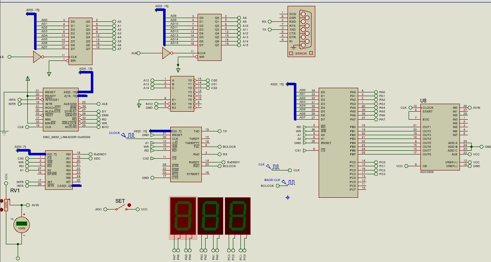

# PROTEUS-ESP8266-8086MPU-SERIAL-PARALLEL-COMMUNICATION
## Objective
Try making a real mcu (esp8266 in this case) communicate serially with the 8086 simulated microprocessor in proteus hosted on a computer

## Approach
Hardware Connection

    

3. Close the file.
1. ### Sending From ESP8266 to 8086
    Start a web server on the ESP8266. The server should provide a page with a means of setting a value and sending it to ESP which processes the data and performs a serial write to a COM port via USB. In this case the page is a simple slider made with HTML, styled using CSS and implements XMLHttpRequest for simple background communication.

    From the COM port one should be able to get the data sent from the ESP webserver into proteus. In proteus, 8251A is is used to recieve the serial data. Interupts are implemented to handle incoming data and writes it to Seven Seg Display
2. ### Sending from 8086 to ESP8266
   In proteus a high granularity POT is used inconjuction with and ADC0808 to read input voltage which is passed to an 8255 PORTC. Upon triggering of and interrupt(which must be done manually) the corresponding digital value of the voltage is read and processed by 8086(Thats a lie. No actuall processing occurs). Its then transmitted serially to the PC COM port via 8251A. The ESP8266 reads the value writen to it serially then uses it to control an LED brightness using PWM.
Thats ALL

## Folder Structure
    8086: Contains the proteus schematic project file used with the assembly code. MASM32 is used as the assembler
    ESP8266: contains the C++ file used to program the MCU and the webpage file in the data sub directory.
    ## NB PlatformIO is used
